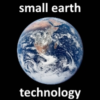

    
     
    <em>Whitespace is the programmers punctuation mark</em>

# Welcome to the MauiTailscaleGrpc Solution

This solution is an evolution of my ANT+ Class Libraries project. Whimsically, it grew out of my
desire to show my friends at the local watering hole what I was working on. I wanted to pull out my
phone, launch my fancy MAUI app, connect to my computer at home, interact with the ANT sensors I was
simulating on my home computer, and savor a sip of bourbon!

## Tailscale as my Networking Solution

I was looking at various homelab setups and VPNs and came across Tailscale. Tailscale checked all my
boxes - free with a decent feature set, simple setup/administration, and secure. I didn't want to open
the gates to just any hacker or script kiddie.

I set up Tailscale on my home computer and my phone, and I was able to connect to my home network, aka
tailnet. This was great, but I needed a way to interact with my ANT+ sensors over Tailscale.

## AntGrpc.Shared Project

gRPC is a modern, high-performance framework for remote procedure calls. It uses HTTP/2 for transport,
and Protocol Buffers as the interface description language. gRPC is well-suited for connecting and
communicating between distributed systems.

The AntGrpc.Shared project contains the Protocol Buffer definitions and generates code for both the
server and client applications. It defines the services and messages used for communication between
the gRPC server and the MAUI client application.

## ANT+ Server Project

The AntPlusServer project is an ASP.NET console application that hosts the gRPC server. It listens for incoming
connections from clients and handles requests to interact with ANT+ sensors. One of the primary NuGet packages
used by the server is the Small Earth Technology ANT USB Stick package. It handles the low-level interaction
with the ANT USB-m stick.

It runs on my home computer, which is connected to the ANT+ sensors via two ANT USB-m sticks. One stick
serves as a simulator for various ANT+ sensors, while the other stick is used by the gRPC server to interact
with the simulated sensors. I use SimulANT+ to simulate the ANT+ sensors.

## ANT+ MAUI Client Application

The AntPlusMauiClient project is a cross-platform mobile application built with .NET MAUI. It serves as the
client that connects to the gRPC server hosted by the AntPlusServer project. The MAUI app provides a
user-friendly interface to interact with ANT+ sensors remotely. One of the primary NuGet packages used in this
application is the Small Earth Technology ANT+ Class Libraries hosting extension, which provides the necessary
functionality to communicate with ANT+ devices.

### Supporting Documents

- [Small Earth Technology ANT+ Class Libraries](https://stephenhidem.github.io/AntPlus): Small Earth Technology ANT+ Libraries docs.
- [Software Tools - THIS IS ANT](https://www.thisisant.com/developer/resources/software-tools/): Tools available from Garmin/Dynastream.
- [Tailscale Documentation](https://tailscale.com/kb/): Official Tailscale documentation and guides.
- [gRPC Documentation](https://grpc.io/docs/): Official gRPC documentation and resources.
- [.NET MAUI Documentation](https://learn.microsoft.com/en-us/dotnet/maui/): Official .NET MAUI documentation and tutorials.
- [.NET MAUI Community Toolkit](https://learn.microsoft.com/en-us/dotnet/communitytoolkit/maui/): Community toolkit for .NET MAUI applications.
- [.NET MVVM Toolkit](https://learn.microsoft.com/en-us/dotnet/communitytoolkit/mvvm/): MVVM toolkit for building maintainable applications.
